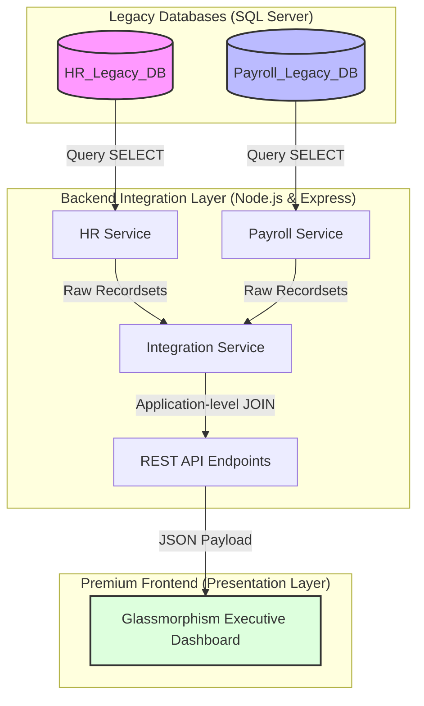

# EXECUTIVE INTEGRATION DASHBOARD (HR & PAYROLL INTEGRATION)
## BÀI TẬP THỰC HÀNH MÔN HỌC: TÍCH HỢP HỆ THỐNG PHẦN MỀM (SE445)

> [!NOTE]  
> **DANH CHO NHÀ TUYỂN DỤNG (RECRUITER QUICK VIEW)**  
> Dự án này không chỉ là một bài tập học thuật đơn thuần, mà là một mô hình giải quyết bài toán tích hợp dữ liệu doanh nghiệp thực tế. Repo này thể hiện khả năng thiết kế hệ thống, tối ưu hóa hiệu năng xử lý bất đồng bộ, tư duy lập trình tối giản (Vanilla JS) và giải quyết các bài toán ràng buộc nghiệp vụ trong môi trường doanh nghiệp thực tế.

---

## 📌 1. Bối cảnh Doanh nghiệp & Bài toán Tích hợp

### Bối cảnh Thực tế
Trong các kịch bản M&A (Sáp nhập & Mua lại) hoặc vận hành doanh nghiệp lớn, hệ thống **Nhân sự (HR)** và hệ thống **Lương (Payroll)** thường chạy độc lập trên các hạ tầng di sản (Legacy Systems). Việc hợp nhất dữ liệu gặp các rào cản lớn:
* **Hộp đen cơ sở dữ liệu (Black-box DB)**: Không được quyền can thiệp thay đổi cấu trúc bảng, không được ghi trực tiếp, không được cài đặt triggers hoặc stored procedures để tránh phá vỡ tính ổn định của hệ thống cũ.
* **Bảo mật dữ liệu**: Tầng tích hợp chỉ được cấp quyền **Read-Only (SELECT)** để khai thác dữ liệu phục vụ báo cáo cho Ban Giám Đốc (CEO).

### Giải pháp Tích hợp Tầng Trình diễn (Presentation-level Integration)
Dự án triển khai một **Integration Gateway (Node.js/Express)** trung gian đóng vai trò cầu nối:
1. Đọc dữ liệu độc lập và an toàn từ 2 database.
2. Gộp dữ liệu tại bộ nhớ đệm (RAM) của ứng dụng bằng các thuật toán tối ưu.
3. Cung cấp API chuẩn hóa để Frontend kết xuất báo cáo thống kê trực quan.

---

## 🏗️ 2. Kiến trúc Tích hợp & Sơ đồ luồng dữ liệu



* **HR_Legacy_DB**: Quản lý hồ sơ nhân sự (Phòng ban, Ngày sinh, Ngày tuyển dụng, Sắc tộc, Tình trạng hôn nhân, Số ngày phép đã dùng...).
* **Payroll_Legacy_DB**: Quản lý chính sách lương & đãi ngộ (Lương năm nay, Lương năm ngoái, Trạng thái cổ đông, Loại hình lao động, Gói phúc lợi...).

---

## ⚡ 3. Quyết định Thiết kế & Tối ưu hóa Kỹ thuật (Design Tradeoffs)

Dự án này chứng minh năng lực đưa ra quyết định kỹ thuật dựa trên các đánh giá đánh đổi thiết thực:

### 1. Chọn Application-level JOIN thay vì Database-level JOIN (Linked Server / Cross-DB Query)
* **Lý do**: Sử dụng Linked Server hoặc Cross-Database Query tăng độ phụ thuộc vật lý giữa hai DB, giảm khả năng mở rộng (scale) và tạo gánh nặng kết nối trực tiếp trên SQL Server. 
* **Giải pháp**: Tải dữ liệu thô về Node.js RAM và thực hiện JOIN trong memory. Việc này giúp giảm tải cho SQL Server, cô lập cơ sở dữ liệu và dễ dàng chuyển đổi sang kiến trúc Microservices sau này.

### 2. Tối ưu hiệu năng kết xuất dữ liệu
* **Truy vấn song song (Parallel Promises)**: Thay vì truy vấn tuần tự làm nhân đôi thời gian phản hồi (Latency), backend sử dụng `Promise.all` để lấy dữ liệu đồng thời từ cả hai cơ sở dữ liệu:
  ```javascript
  const [employees, payrolls] = await Promise.all([
      hrService.getAllEmployees(),
      payrollService.getAllPayroll()
  ]);
  ```
* **Bản đồ tra cứu O(1) (Lookup Map Optimization)**: Thay vì sử dụng hai vòng lặp lồng nhau có độ phức tạp thuật toán là $O(N^2)$, dự án chuyển đổi danh sách Lương sang cấu trúc dữ liệu `Map` trong JavaScript để thực hiện liên kết dữ liệu với độ phức tạp tối ưu là $O(N)$:
  ```javascript
  const payrollMap = new Map();
  payrolls.forEach(p => payrollMap.set(p.Employee_ID, p));
  const merged = employees.map(emp => {
      const payroll = payrollMap.get(emp.Employee_ID) || {};
      // mapping logic...
  });
  ```

### 3. Thiết kế Giao diện tập trung hiệu năng (Zero-Framework Vanilla JS Frontend)
* Thay vì sử dụng các Framework cồng kềnh (như React/Angular) làm phình to dung lượng tải trang không cần thiết đối với một ứng dụng Single-Page Dashboard, dự án sử dụng **Vanilla JavaScript thuần túy** kết hợp với **CSS Grid/Flexbox** và **Chart.js**. 
* Giao diện tải gần như lập tức và có hoạt ảnh mượt mà, đạt điểm hiệu năng cao trên Lighthouse.

---

## 🌟 4. Kỹ năng & Kiến thức Đạt được sau Dự án

Qua việc thực hiện dự án này, người phát triển đã tích lũy và thể hiện được các kỹ năng quan trọng của một **Fullstack/Integration Engineer**:

### Kỹ năng Thiết kế Kiến trúc & Tích hợp (Integration Patterns)
- Hiểu sâu sắc và áp dụng thành công mô hình tích hợp dữ liệu tầng trình diễn (Presentation-level integration).
- Nắm vững nguyên lý kết nối bất đồng bộ và kiểm soát hồ kết nối dữ liệu (Connection Pooling) trong SQL Server thông qua thư viện Node-mssql.
- Xây dựng hệ thống cảnh báo nghiệp vụ thông minh bằng kỹ thuật tự động phân tích dữ liệu gộp thời gian thực (real-time data analytics).

### Kỹ năng Backend & Database Security
- Quản lý phân quyền đăng nhập SQL Server an toàn (SQL Server Authentication), tạo các tài khoản `db_datareader` có quyền lực tối thiểu nhằm tuân thủ nguyên tắc **Least Privilege (Quyền hạn tối thiểu)**.
- Sử dụng tham số hóa truy vấn (Parameterized Queries) để triệt tiêu hoàn toàn nguy cơ tấn công **SQL Injection**.
- Xây dựng API Clean Architecture: Phân tách rõ ràng giữa cấu hình (`config/`), tuyến định tuyến (`routes/`), và tầng xử lý logic nghiệp vụ (`services/`).

### Kỹ năng Frontend & UI/UX Design
- Thiết kế giao diện **Glassmorphism Dark Theme** thời thượng sử dụng CSS Variables để quản lý các mã màu neon rực rỡ và soft glows.
- Áp dụng các micro-animations tinh tế (hover transitions, card pulse) tạo cảm giác giao diện "sống động" và phản hồi tích cực với thao tác của người dùng.
- Kỹ năng tích hợp thư viện đồ thị chuyên sâu (Chart.js), định cấu hình vẽ biểu đồ cột phức hợp (Grouped Bar Chart) và biểu đồ Doughnut có tùy chỉnh tooltip, màu sắc gradient nâng cao.
- **Tư duy hướng đến hành động của CEO**: Thống kê KPIs có thể click để chuyển nhanh màn hình, tạo Action Center để CEO ra chỉ thị lập tức từ các cảnh báo hệ thống, tích hợp tính năng tải báo cáo PDF/Excel mô phỏng tiện dụng.

---

## ⚙️ 5. Hướng dẫn Cài đặt & Chạy dự án (Dev Setup)

### Bước 1: Khởi tạo Cơ sở Dữ liệu (SQL Server)
1. Mở **SQL Server Management Studio (SSMS)** và kết nối tới SQL Server (thường là `localhost\SQLEXPRESS`).
2. Mở và chạy lần lượt các script SQL trong thư mục [`database/`](file:///d:/University/TichHopHeThong/SE445/Project/database/):
   * Chạy [`01_create_hr_db.sql`](file:///d:/University/TichHopHeThong/SE445/Project/database/01_create_hr_db.sql) để tạo DB nhân sự `HR_Legacy_DB`.
   * Chạy [`02_create_payroll_db.sql`](file:///d:/University/TichHopHeThong/SE445/Project/database/02_create_payroll_db.sql) để tạo DB lương `Payroll_Legacy_DB`.
   * Chạy [`03_insert_mock_data.sql`](file:///d:/University/TichHopHeThong/SE445/Project/database/03_insert_mock_data.sql) để nạp 10 bản ghi mẫu.

### Bước 2: Tạo tài khoản đăng nhập SQL Server (SQL Authentication)
Để ứng dụng Express kết nối DB bảo mật, chạy đoạn mã dưới đây trong SSMS để tạo tài khoản phân quyền Read-Only:
```sql
CREATE LOGIN dashboard_user WITH PASSWORD = '123456';
GO

USE HR_Legacy_DB;
CREATE USER dashboard_user FOR LOGIN dashboard_user;
ALTER ROLE db_datareader ADD MEMBER dashboard_user;
GO

USE Payroll_Legacy_DB;
CREATE USER dashboard_user FOR LOGIN dashboard_user;
ALTER ROLE db_datareader ADD MEMBER dashboard_user;
GO
```

### Bước 3: Cấu hình biến môi trường
1. Di chuyển vào thư mục [`backend/`](file:///d:/University/TichHopHeThong/SE445/Project/backend/).
2. Tạo file `.env` bằng cách copy nội dung từ file [`.env.local`](file:///d:/University/TichHopHeThong/SE445/Project/backend/.env.local).
3. Đảm bảo cấu hình khớp với SQL Server nội bộ của bạn:
   ```env
   DB_SERVER=localhost\\SQLEXPRESS  # Server name
   DB_PORT=1433                     # SQL Port
   DB_USER=dashboard_user
   DB_PASSWORD=123456
   HR_DB_NAME=HR_Legacy_DB
   PAYROLL_DB_NAME=Payroll_Legacy_DB
   PORT=3000
   MAX_VACATION_DAYS=15
   ANNIVERSARY_ALERT_DAYS=30
   ```

### Bước 4: Khởi chạy dự án
Mở Terminal tại thư mục [`backend/`](file:///d:/University/TichHopHeThong/SE445/Project/backend/) và chạy:
```bash
# Cài đặt thư viện
npm install

# Chạy server ở chế độ phát triển
npm run dev
```

* **Trang chủ Dashboard**: [http://localhost:3000](http://localhost:3000)
* **Kiểm tra trạng thái liên kết hệ thống**: [http://localhost:3000/api/health](http://localhost:3000/api/health)
* **Báo cáo kết quả kiểm thử (Walkthrough)**: [`walkthrough.md`](file:///C:/Users/duyng/.gemini/antigravity-ide/brain/a0453682-36b1-4628-8c33-0f375df7f76e/walkthrough.md)
