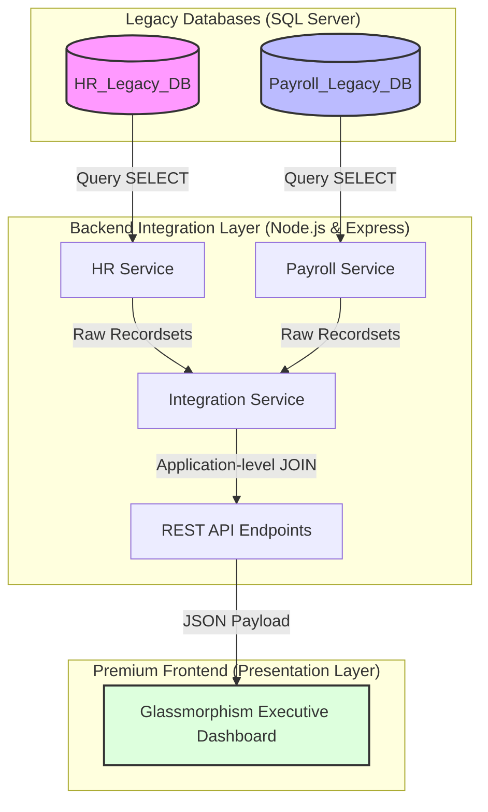

# EXECUTIVE INTEGRATION DASHBOARD (HR & PAYROLL INTEGRATION)
## BÀI TẬP THỰC HÀNH MÔN HỌC: TÍCH HỢP HỆ THỐNG PHẦN MỀM (SE445)

> [!NOTE]  
> **GÓC NHÌN NHÀ TUYỂN DỤNG (RECRUITER REVIEW)**  
> Đây là dự án thực hành môn học giải quyết bài toán tích hợp dữ liệu giữa hai hệ thống di sản (Legacy Systems) hoạt động độc lập. Dự án tập trung vào việc áp dụng phương pháp tích hợp dữ liệu ở tầng trình diễn (Presentation-level integration), tối ưu hóa thời gian xử lý bất đồng bộ ở backend, và xây dựng giao diện tương tác trực quan mà không cần can thiệp cấu trúc dữ liệu di sản.

---

## 📌 1. Bối cảnh Doanh nghiệp & Bài toán Tích hợp

### Bối cảnh Thực tế
Trong các kịch bản sáp nhập doanh nghiệp (M&A) hoặc vận hành hệ thống lớn, cơ sở dữ liệu **Nhân sự (HR)** và **Lương (Payroll)** thường chạy độc lập trên các hạ tầng riêng biệt. Việc liên kết dữ liệu gặp các rào cản thực tế:
* **Nguyên lý Hộp đen (Black-box DB)**: Không có quyền chỉnh sửa schema, không được ghi đè, và không được tạo trigger hay stored procedure trên hai cơ sở dữ liệu cũ để tránh phá vỡ tính ổn định của hệ thống đang chạy ổn định.
* **Quyền truy cập tối thiểu**: Tầng tích hợp chỉ được cấp quyền đọc dữ liệu (**Read-Only SELECT**) nhằm đảm bảo tính toàn vẹn thông tin và bảo mật.

### Giải pháp Tích hợp Tầng Trình diễn (Presentation-level Integration)
Dự án xây dựng một **Integration Gateway (Node.js/Express)** trung gian làm nhiệm vụ:
1. Kết nối và lấy dữ liệu thô độc lập từ 2 cơ sở dữ liệu SQL Server.
2. Thực hiện ghép nối (JOIN) và xử lý tổng hợp dữ liệu tại bộ nhớ RAM của ứng dụng.
3. Cung cấp các API chuẩn hóa để Frontend kết xuất báo cáo phục vụ ban giám đốc.

---

## 🏗️ 2. Kiến trúc Tích hợp & Sơ đồ luồng dữ liệu



* **HR_Legacy_DB**: Lưu trữ hồ sơ nhân sự (Phòng ban, giới tính, ngày sinh, ngày tuyển dụng, số ngày phép đã dùng...).
* **Payroll_Legacy_DB**: Lưu trữ thông tin lương, loại hình làm việc, trạng thái cổ đông, và gói phúc lợi...

---

## ⚡ 3. Quyết định Thiết kế & Tối ưu hóa Kỹ thuật (Design Tradeoffs)

Dự án đưa ra các quyết định kỹ thuật dựa trên sự cân nhắc ưu - nhược điểm thực tế:

### 1. Chọn Application-level JOIN thay vì Database-level JOIN (Linked Server / Cross-DB Query)
* **Đánh đổi (Trade-off)**: Sử dụng Linked Server hay Cross-Database query trên SQL Server giúp viết code nhanh hơn thông qua câu lệnh SQL JOIN trực tiếp. Tuy nhiên, nó vi phạm tính độc lập của 2 cơ sở dữ liệu di sản (Black-box DB) và tăng gánh nặng xử lý cho SQL Server.
* **Lựa chọn thực tế**: Dự án quyết định truy vấn dữ liệu thô độc lập từ từng cơ sở dữ liệu và thực hiện liên kết (JOIN) dữ liệu bằng JavaScript tại tầng ứng dụng (Node.js).
* **Hạn chế tồn tại**: Giải pháp này chỉ phù hợp với quy mô dữ liệu vừa và nhỏ (ví dụ các dữ liệu báo cáo cho ban quản trị). Nếu dữ liệu lên tới hàng triệu dòng, việc tải dữ liệu thô về RAM Node.js sẽ gây quá tải bộ nhớ và nghẽn băng thông mạng. Khi đó, hệ thống sẽ cần kiến trúc đồng bộ dữ liệu (ETL/CDC) sang một cơ sở dữ liệu chung (Data Warehouse) thay vì ghép nối trực tiếp tại thời điểm truy vấn.

### 2. Tối ưu hiệu năng kết xuất dữ liệu tại Backend
* **Truy vấn song song (Parallel execution)**: Thay vì truy vấn tuần tự làm tăng gấp đôi thời gian phản hồi API, backend sử dụng `Promise.all` để gửi yêu cầu truy vấn đồng thời tới cả hai CSDL:
  ```javascript
  const [employees, payrolls] = await Promise.all([
      hrService.getAllEmployees(),
      payrollService.getAllPayroll()
  ]);
  ```
* **Liên kết dữ liệu tối ưu qua Map O(1)**: Thay vì dùng hai vòng lặp lồng nhau có độ phức tạp thuật toán là $O(N^2)$, dự án chuyển danh sách Lương sang cấu trúc dữ liệu `Map` để tối ưu hóa thời gian tra cứu xuống còn $O(1)$, giúp tổng thời gian JOIN dữ liệu đạt độ phức tạp tuyến tính $O(N)$.
  ```javascript
  const payrollMap = new Map();
  payrolls.forEach(p => payrollMap.set(p.Employee_ID, p));
  const merged = employees.map(emp => {
      const payroll = payrollMap.get(emp.Employee_ID) || {};
      // mapping logic...
  });
  ```

### 3. Lựa chọn công nghệ Frontend (Vanilla JS vs Frameworks)
* **Lý do lựa chọn**: Do quy mô của dashboard chỉ tập trung hiển thị các báo cáo tĩnh và các biểu đồ cơ bản, việc sử dụng các Framework lớn (như React, Vue) là không thực sự cần thiết (Over-engineering). Dự án lựa chọn **Vanilla JS** thuần túy kết hợp với **CSS Grid/Flexbox** và **Chart.js**.
* **Ưu điểm**: Giúp giữ cho mã nguồn frontend cực kỳ gọn nhẹ (dung lượng tải trang thấp), dễ dàng chạy trực tiếp trên các trình duyệt mà không cần bước build phức tạp, đồng thời giúp nhà phát triển rèn luyện sâu sắc khả năng thao tác DOM thuần.

---

## 🌟 4. Kết quả Học tập & Kiến thức Thu hoạch

Dự án này là cơ hội tốt để thực hành các kỹ năng thực tế về thiết kế và phát triển phần mềm:

### Kiến thức về Tích hợp Hệ thống (Software Integration)
- Hiểu và áp dụng phương pháp tích hợp ở tầng hiển thị (Presentation-level Integration), hiểu rõ ưu/nhược điểm so với tích hợp ở tầng dữ liệu (Data-level Integration).
- Biết cách quản lý kết nối cơ sở dữ liệu hiệu quả bằng kỹ thuật **Connection Pooling** với SQL Server nhằm tối ưu hóa tài nguyên mạng.
- Xây dựng logic phát hiện bất thường từ dữ liệu tổng hợp (như nhân viên dùng vượt ngày phép, biến động thu nhập đột ngột).

### Bảo mật Hệ thống (Security Hardening)
- Áp dụng nguyên tắc quyền hạn tối thiểu (**Least Privilege**): Phân quyền tài khoản kết nối CSDL chỉ có quyền đọc (`db_datareader`), ngăn chặn rủi ro ghi đè dữ liệu cũ.
- Thực hành bảo vệ mã nguồn: Sử dụng **Parameterized Queries** để phòng chống lỗ hổng SQL Injection và triển khai làm sạch đầu vào ngăn ngừa XSS trên giao diện.
- Tổ chức mã nguồn backend theo cấu trúc phân tầng rõ ràng (`config/`, `routes/`, `services/`) giúp code dễ đọc và bảo trì.

### Trải nghiệm Người dùng (UI/UX) & Kết xuất Báo cáo
- Thực hành xây dựng giao diện responsive đẹp mắt với CSS Grid/Flexbox và CSS Variables.
- Làm quen với thư viện trực quan hóa dữ liệu **Chart.js** (vẽ biểu đồ cột phức hợp, biểu đồ doughnut, cấu hình tooltips linh hoạt).
- Cải thiện tư duy thiết kế hướng người dùng: Thiết kế luồng tương tác nhanh từ các cảnh báo, hỗ trợ drill-down xem hồ sơ nhân sự liên kết chi tiết và giả lập tính năng xuất báo cáo định dạng PDF/Excel.

---

## ⚙️ 5. Hướng dẫn Cài đặt & Chạy dự án (Dev Setup)

### Bước 1: Khởi tạo Cơ sở Dữ liệu (SQL Server)
1. Mở **SQL Server Management Studio (SSMS)** và kết nối tới SQL Server (thường là `localhost\SQLEXPRESS`).
2. Mở và chạy lần lượt các script SQL trong thư mục [`database/`](file:///d:/University/TichHopHeThong/SE445/Project/database/):
   * Chạy [`01_create_hr_db.sql`](file:///d:/University/TichHopHeThong/SE445/Project/database/01_create_hr_db.sql) để tạo DB nhân sự `HR_Legacy_DB`.
   * Chạy [`02_create_payroll_db.sql`](file:///d:/University/TichHopHeThong/SE445/Project/database/02_create_payroll_db.sql) để tạo DB lương `Payroll_Legacy_DB`.
   * Chạy [`03_insert_mock_data.sql`](file:///d:/University/TichHopHeThong/SE445/Project/database/03_insert_mock_data.sql) để nạp 10 bản ghi mẫu.

### Bước 2: Tạo tài khoản đăng nhập SQL Server (SQL Authentication)
Để ứng dụng Express kết nối DB bảo mật, chạy đoạn mã dưới đây trong SSMS để tạo tài khoản phân quyền Read-Only:
```sql
CREATE LOGIN dashboard_user WITH PASSWORD = '123456';
GO

USE HR_Legacy_DB;
CREATE USER dashboard_user FOR LOGIN dashboard_user;
ALTER ROLE db_datareader ADD MEMBER dashboard_user;
GO

USE Payroll_Legacy_DB;
CREATE USER dashboard_user FOR LOGIN dashboard_user;
ALTER ROLE db_datareader ADD MEMBER dashboard_user;
GO
```

### Bước 3: Cấu hình biến môi trường
1. Di chuyển vào thư mục [`backend/`](file:///d:/University/TichHopHeThong/SE445/Project/backend/).
2. Tạo file `.env` bằng cách copy nội dung từ file [`.env.local`](file:///d:/University/TichHopHeThong/SE445/Project/backend/.env.local).
3. Đảm bảo cấu hình khớp với SQL Server nội bộ của bạn:
   ```env
   DB_SERVER=localhost\\SQLEXPRESS  # Server name
   DB_PORT=1433                     # SQL Port
   DB_USER=dashboard_user
   DB_PASSWORD=123456
   HR_DB_NAME=HR_Legacy_DB
   PAYROLL_DB_NAME=Payroll_Legacy_DB
   PORT=3000
   MAX_VACATION_DAYS=15
   ANNIVERSARY_ALERT_DAYS=30
   ```

### Bước 4: Khởi chạy dự án
Mở Terminal tại thư mục [`backend/`](file:///d:/University/TichHopHeThong/SE445/Project/backend/) và chạy:
```bash
# Cài đặt thư viện
npm install

# Chạy server ở chế độ phát triển
npm run dev
```

* **Trang chủ Dashboard**: [http://localhost:3000](http://localhost:3000)
* **Kiểm tra trạng thái liên kết hệ thống**: [http://localhost:3000/api/health](http://localhost:3000/api/health)